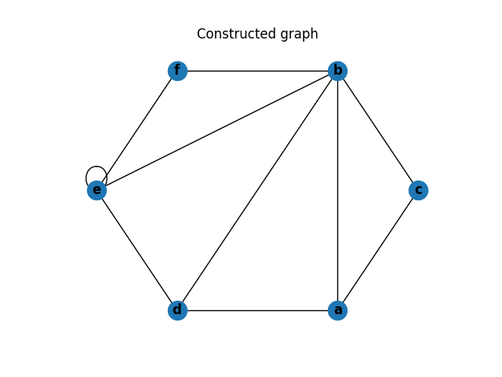
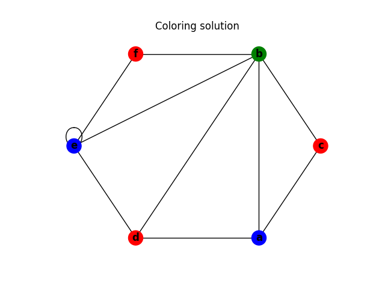
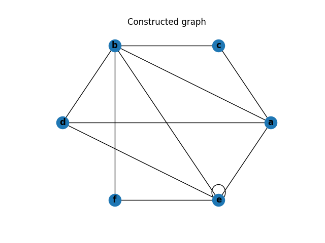
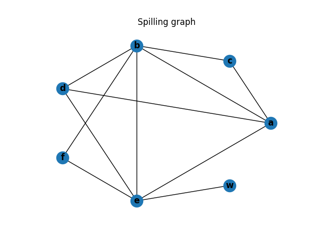
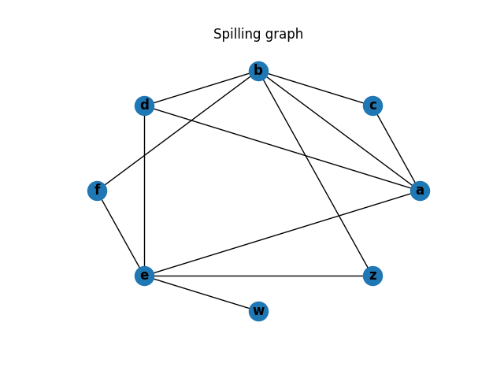
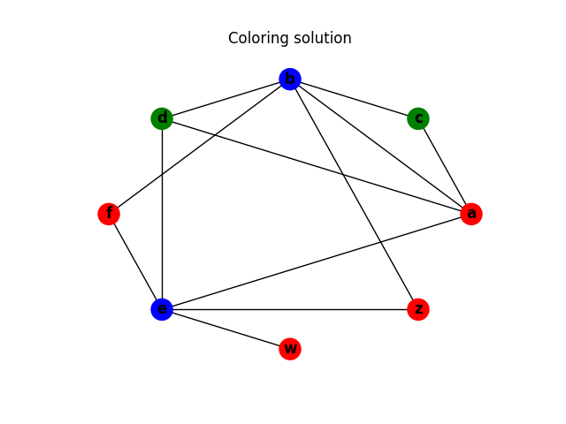

# Overview of Register Allocation in Modern Compiler from Graph Coloring to Machine Learning

## Introduction
In this project, I cover register allocation and assignment, which are among the most important compiler optimizations for almost all computer architectures. The problem addressed is how to minimize traffic between the CPU registers, which are usually few and fast to access, and whatever lies beyond them in the memory hierarchy, including one or more levels of cache and main memory, all of which are slower to access and larger, generally increasing in size and decreasing in speed the further we move away from the registers.

In this project, I will review the register allocation strategy in an experimental PL/I optimizing compiler and the state-of-the-art modern compiler, LLVM. I will reimplement both register allocation algorithms, benchmark and comparing different efficiency between heuristic greedy algorithm and machine learning algorithm on spill.

## Register Allocation Overview

Register allocation is best carried out on low-level intermediate code or assembly language. It is essential that all loads from and stores to memory, including their address computations, be represented explicitly. The project's central focus, global register allocation by graph coloring, usually results in very effective allocations without a major cost in compilation speed. It views the fact that two quantities must be in registers simultaneously as excluding them from being in the same register. It represents the quantities by nodes in a graph and the exclusions (called interferences) by arcs between the corresponding nodes; the nodes may represent real registers also, and the arcs may represent exclusions such as the base address in a memory access may not be the register r0. Given the graph corresponding to an entire procedure, this method then attempts to color the nodes, with the number of colors equal to the number of available real registers. Every node is assigned a color that is distinct from those of all the nodes adjacent to it. If this cannot be achieved, additional code is introduced to storequantities to memory and to reload them as needed, and the process is repeated until a satisfactory coloring is achieved. As we will see, even very simple formulations of graph-coloring problems are NP-complete, so one of the most important facets of making global register allocation as effective as possible is using highly effective heuristics.

## Basic Example

First, we will discuss a simple example that uses few variables and registers. Below is a simple section of code, on the left is the code and on the right is the live set at each step of the code [3].

At the beginning of the code, a variable _a_ is alive. Then _a_ is used to compute a new variable, _b_, which enters the live set. _b_ is used to compute another new variable, _c_, which also enters the live set. Because this is the last time this instance of _b_ is used, _b_ exits the live set. Then a new instance of _b_ is created using _c_. _c_ is not used again so it exits the live set. At the end we are left with _a_ and _b_ in the live set.

```
                {a}
b = a + 2
                {a, b}
c = b * b
                {a, c}
b = c + 1
                {a, b}
return b * a
```

Chaitin's algorithm is designed to take an intermediate language as input rather than high-level code. The intermediate language indicates when variables are defined, when they are used, and whether they are dead or alive.

In this Python implementation of Chaitin's algorithm, the above code can be represented to the following intermediate language.

```
IntermediateLanguage([
    Instruction(
        'bb',
        [Dec('a', False)],
        []),
    Instruction(
        'b = a + 2',
        [Dec('b', False)],
        [Use('a', False)]
    ),
    Instruction(
        'c = b * b',
        [Dec('c', False)],
        [Use('b', True)]
    ),
    Instruction(
        'b = c + 1',
        [Dec('b', False)],
        [Use('c', True)]
    ),
    Instruction(
        'return b * a',
        [],
        [Use('a', True), Use('b', True)]
    )
])
```

The code and intermediate language can be represented by the following graph. The graph has an edge connecting _a_ to _b_ and _a_ to _c_ which is expected based on the live set.



This graph can be 2-colored, indicating two registers are required to execute the code.



## Subsumption Example

After building the interference graph, the next step of the algorithm is to eliminate unnecessary register copy operations. This is done by coalescing or combining the nodes which are the source and targets of copy operations.

The previous example can be modified to add a new variable, _d_, which is a copy of _c_. _d_ is then used in place of _c_ in the remainder of the example. When the initial interference graph is built, it shows that there is interference between _a_ and _b_, _a_ and _c_, and _a_ and _d_. 

```
                {a}
b = a + 2
                {a, b}
c = b * b
                {a, c}
d = c
                {a, d}
b = d + 1
                {a, b}
return b * a
```


However, in the coalescing phase, the algorithm identifies the copy from _c_ to _d_ and replaces references of _d_ with _c_. The graph now matches the previous example which has already been shown to be 2-colorable by the algorithm.


## Multiple Basic Blocks

Chaitin's register allocation example can be applied to programs with multiple basic blocks as well. Although this example is larger and more complex than the previous examples, the same steps still apply [4]. The algorithm computes the interference graph, checks for unnecessary copy operations, and colors the graph.


The above diagram was taken from M. Perkowski's slides [4].


One of the inputs to the algorithm are the colors (registers) available, so as long as four colors are available to color the graph, no additional steps are necessary because the graph is 4-colorable.


## Spilling

The previous example did not require any additional steps beyond what the basic example used because enough colors were available to color the graph without any changes. But what happens if only three colors are available instead of four?

The graph coloring algorithm will not be able find a way to 3-color the graph in its current form and will return an undefined result. At this point the algorithm will have to spill at least one variable to main memory. Determining which variable to spill is a multi-step process.

First, the algorithm computes a cost estimate of each variable. This cost estimate is equal to "the number of definition points plus the number of uses of that computation, where each definition and use is weighted by its estimated execution frequency [1]." The frequency is provided as an input into the algorithm for each basic block.

After computing the cost estimates, the algorithm will pick which variables to spill based on their costs and insert the instructions to spill the chosen variables into the intermediate language. The algorithm will then rebuild the interference graph, check for unnecessary copy operations, and attempt to color the graph again. Typically only one round of spilling is required, but Chaitin mentions that "it is sometimes necessary to loop through this process yet again, adding a little more spill code, until a 32-coloring is finally obtained [1]."

Below is the interference graph of the multiple building block example.



If we change the number of available registers from four to three, the graph is no longer colorable and at least one spill will be required.

Because this example is not based on an actual program, the frequencies for each basic block can be assigned arbitrarily. For this example, we assign the top basic block a frequency of 1, the left basic block a frequency of 0.75, the right basic block a frequency of 0.25, and the bottom basic block a frequency of 1. These frequencies result in the following cost estimates:

```
{
    'a': 2,
    'b': 2.25,
    'c': 2,
    'd': 2.25,
    'e': 2.25,
    'f': 2.75
}
```

After computing these costs, the algorithm determines which symbols to spill. It first finds all the symbols in the intermediate language and removes any symbols from the interference graph that have a degree less than the number of colors available. Once it runs out of symbols to remove, it chooses the least costly symbol, adds it to the spill list, and removes it from the graph. This process continues until all symbols have been processed.

_a_ and _c_ are the two least costly variables in the example but _a_ has a degree less than the number of colors, so spilling it is not necessary. Therefore, _c_ is spilled.

Below is the interference graph after spilling _c_.




Now after spilling _c_, the graph is 3-colorable.



### Frequency Optimization

If we adjust the frequencies so that _f_ is the least costly symbol, the algorithm will decide to spill _f_.

After spilling _f_, the graph is 3-colorable.



### Optimization by Constructing 1-Layer Hopfield Neural Network

LLVM has their own improvement upon the basic linear scanning algorithm which allows for multiple different weights and heuristics along the way. A hopfield network is constructed to determine which variable gets spilled.

$$
E = -sum_n V_n * ( B_n + sum_{n, m, \text{ linked by } b} V_m * F_b )
$$

## Implementation Experience

There were several challenges I encountered when implementing this algorithm. 

The first challenge was understanding SETL and translating it to Python. As someone unfamiliar with SETL, I found some aspects of the language difficult to understand at first. For example, something like

```
f := { [ source, target ] } ;
graph := { { f(x) ? x : element of edge } : edge element of graph } ;
```

is indicating that any edge with an endpoint of `source` should be changed to `target`. Other places in the algorithm use `x` and `y` to represent distinct endpoints so when I initially implemented this step, I only looked at the first endpoint on an edge. Fortunately, I found the paper that introduced SETL which was a useful resource whenever I was confused about something in the language [2].

Another challenge is that there are places in the algorithm where a variable is used without being initialized and without any indication of what it represents. For example, during the insert spill code step, `newat` appears for the first time in the statement `newuse +:= [ [ ( newreg := newat ), true ] ] ;`. If `newat` is replaced with the name of the old register, the algorithm produces expected results, but if I was writing production quality code, I would want to confirm what this variable represents.

Finally, the third challenge of this algorithm was that it uses global variables to store data used in multiple steps of the algorithm. Implementing the code this way made it difficult to test and experiment with specific examples. I ended up refactoring the code to eliminate global variables and share state using function parameters instead.

## Resources

1. G. Chaitin. 2004. Register allocation and spilling via graph coloring. SIGPLAN Not. 39, 4 (April 2004), 66–74. DOI:https://doi.org/10.1145/989393.989403
    1. Paper also available here: https://cs.gmu.edu/~white/CS640/p98-chaitin.pdf
2. K. Kennedy, J. Schwartz. 1975. An introduction to the set theoretical language SETL. Computers & Mathematics with Applications. Volume 1, Issue 1, 97-119. DOI:https://doi.org/10.1016/0898-1221(75)90011-5.
3. V. Vene. 2010. Register allocation. http://kodu.ut.ee/~varmo/TM2010/slides/tm-reg.pdf
4. M. Perkowski. 2001. Register allocation (via graph coloring). http://web.cecs.pdx.edu/~mperkows/temp/register-allocation.pdf

## Packages used

* [matplotlib](https://matplotlib.org/)
* [networkx](https://networkx.github.io/)