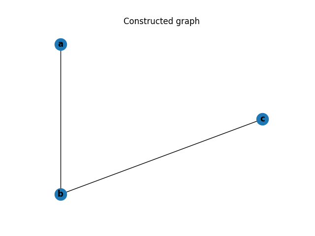
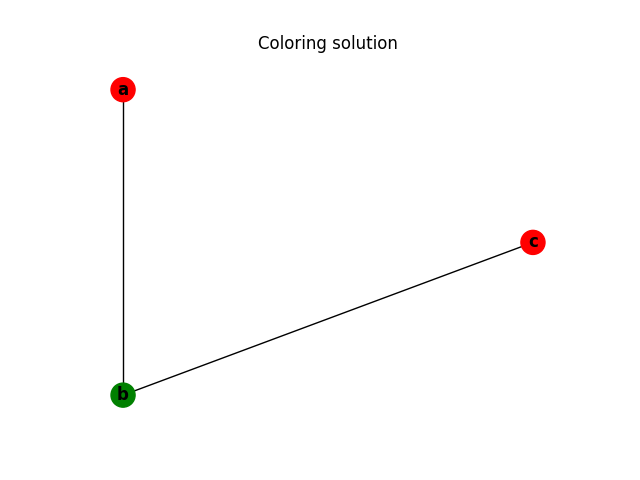

# Overview of Register Allocation in Modern Compiler from Graph Coloring to Machine Learning

## Introduction

In this project, I cover register allocation, which are among the most important compiler optimizations for almost all computer architectures. The problem addressed is how to minimize traffic between the CPU registers, which are usually few and fast to access, and whatever lies beyond them in the memory hierarchy, including one or more levels of cache and main memory, all of which are slower to access and larger, generally increasing in size and decreasing in speed the further we move away from the registers.

In this project, I will review the register allocation strategy in an experimental PL/I optimizing compiler and the state-of-the-art modern compiler, LLVM. I will reimplement both register allocation algorithms, benchmark and comparing different efficiency between 

    - graph coloring algorithm 
    - heuristic greedy algorithm & Hopfield NN on spill

## Overview of Register Allocation in Compiler

Register allocation is best carried out on low-level intermediate code or assembly language. It is essential that all loads from and stores to memory, including their address computations, be represented explicitly. Basic register allocation is including two main step: assign spare register and spill register if register runs out.

The project's central focus, global register allocation by graph coloring, usually results in very effective allocations without a major cost in compilation speed. It views the fact that two quantities must be in registers simultaneously as excluding them from being in the same register. It represents the quantities by nodes in a graph and the exclusions (called interferences) by arcs between the corresponding nodes; the nodes may represent real registers also, and the arcs may represent exclusions such as the base address in a memory access may not be the register r0. 

Given the graph corresponding to an entire procedure, this method then attempts to color the nodes, with the number of colors equal to the number of available real registers. Every node is assigned a color that is distinct from those of all the nodes adjacent to it. If this cannot be achieved, additional code is introduced to storequantities to memory and to reload them as needed, and the process is repeated until a satisfactory coloring is achieved. As we will see, even very simple formulations of graph-coloring problems are NP-complete, so one of the most important facets of making global register allocation as effective as possible is using highly effective heuristics.

Register allocation maps virtual registers to target machine registers. Limited number of registers, varied instruction set and system conventions are the main constraints of the performance of the RA stratagy. Hense, register allocation could be ragard as an optimization problem, including three major tasks:

1. minimize spill and put it in less frequently executed places 
2. use as few registers as possible 
3. eliminate copy instructions

Since the register interference graph is a large and massive data structure, the state-of-art compiler, LLVM, used linear scan rather than graph coloring to do the register assignment task.

## Basic Example

The following simple example contains few variables and registers usage. In the following code block, I presented the live set onthe right and varibale behavior on the left. 

Firstly, a variable _a_ is defined. Then _a_ is used to compute a new variable, _b_, which enters the live set. _b_ is used to compute another new variable, _c_, which also enters the live set. Because this is the last time this instance of _b_ is used, _b_ exits the live set. Then a new instance of _b_ is created using _c_. _c_ is not used again so it exits the live set. At the end we are left with _a_ and _b_ in the live set.

```
                            {a}
    b = a + 2
                            {a, b}
    c = b + b
                            {a, c}
    b = c + 1
                            {a, b}
return b * a
```

In Chaitin's algorithm [1], a dual representation is applied, including a bit matrix and adjacency vectors.

The bit matrix for an $\mathbf{N}$-node interference graph consists of a symmetric matrix of $\mathbf{N}$ bits by $\mathbf{N}$ bits. The bit at row I and column $J$ is a 1 if and only if nodes I and $J$ are adjacent. By keeping for each node in the graph a vector giving the set of nodes which are adjacent to it. The length of this vector is equal to the degree of the node.

The algorithm for building the interference graph is therefore a two pass algorithm. In the first pass over the intermediate language, the bit matrix is used to calculate the degree of each node. Then the $\mathbf{N}$ adjacency vectors are storage allocated, and a second pass is made over the program intermediate language in order to fill in the adjacency vectors. 

## Algorithm 1
- Choose an arbitrary node of degree less than k .
- Push that node onto the stack and remove all of it’s outgoing edges .
- Check if the remaining edges have degree less than k,   
  - if YES goto  5 else goto spill
- If the degree of any remaining vertex is less than k then push it onto to the stack .
- If there is no more edge available to push and if all edges are present in the stack POP each node and color them such that no two adjacent nodes have same color.
- Number of colors assigned to nodes is the minimum number of registers needed .

The code can be represented by the following graph. The graph has an edge connecting _a_ to _b_ and _a_ to _c_ which is expected based on the live set. 
The chromatic number represent the number of register needed for execution. 






## No-Spilling Example

The register number is one of the input in the algorithm. In the case below, only threee colors are require to color the graph, but 4 registers are avaliable.

```
    b = a + 2
    c = b + b
    b = c + 1
    f = 2 + e   
    b = d + e
    e = e - 1
    b = f + c
```


## Spilling Example

In the case below, only 4 colors are require to color the graph, but only 3 registers are avaliable.

```
    a = b + c
    d = a
    e = d + f
    f = 2 + e
    b = d + e
    e = e - 1
    b = f + c
    a = e
```

The graph coloring algorithm will not be able find a way to 4-color the graph in its current form. At this point the algorithm will have to spill at least one variable to main memory. Spill algothitm determin which variable to spill.

First, the algorithm computes a cost estimate of each variable. This cost estimate is equal to the degree of the nodes.

After computing the cost estimates, the algorithm will add edges to the node we pick on the graph to reduce conflicts. The algorithm will then rebuild the interference graph, check for unnecessary copy operations, and attempt to color the graph again. 

Below is the interference graph of above case.


After computing these costs, the algorithm determines which symbols to spill. It first finds all the symbols in the intermediate language and removes any symbols from the interference graph that have a degree less than the number of colors available. Once it runs out of symbols to remove, it chooses the least costly symbol, adds it to the spill list, and removes it from the graph. This process continues until all symbols have been processed. Node containing highest cost is spilled.

Below is the interference graph after spilling _e_.


Now after spilling _e_, the graph is 3-colorable.


### Optimization of Spill by Constructing 1-Layer Hopfield Neural Network

LLVM applied linear scanning algorithm to assgin register. LLVM has their own improvement upon the basic linear scanning algorithm which allows for multiple different weights and heuristics along the way. A hopfield network is constructed to split code block then determine which code block to spill. 

The hopfield network find the optimal split and guaranteed to converge to a local minimum.

$$
a(t)_{s \times 1}=\left\{\begin{array}{lr}
p_{s \times 1} & : t=0 \\
S\left(W_{s \times s} \times a(t-1)_{s \times 1}+b_{s \times 1}\right) & : t \geq 1
\end{array}\right.
$$

$$
S(x)= \begin{cases}+1 & : x \geq \theta \\ -1 & : x<\theta\end{cases}
$$

In the above model, _W_ stands for the weight matrix is trained by the NN. When _t_  = 1, weight matix multiple the output from iteration _t_ = 0 plus a bias. Comparing to a certain threshold $\theta$, we could used +1 and -1 to symbol the code block. 

In spill process, each edge bundle corresponds to a node in a Hopfield network. Edge bundle usually are the code blocks contains same parents or children node. Constraints on basic blocks are weighted by the block frequency and added to become the node bias. These blocks become connections in the Hopfield network, again weighted by block frequency [2]. The Hopfield network minimizes (possibly locally) its energy function:

$$
E = -sum_n V_n * ( B_n + sum_{\text{n, m linked by b}} V_m * F_b )
$$

The energy function represents the expected spill code execution frequency, or the cost of spilling. This is a Lyapunov function which never increases when a node is updated. It is guaranteed to converge to a local minimum.

## Conclusion
In this project, I reviewed the main strategies for solving register allocation problems in compilers. The graph coloring algorithm is reimplemented in this project. Among them, the limited number of physical registers is the focus of the register allocation problem. Spill effectively solves the problem of insufficient registers. However, the complex relationship of real-world code blocks will make the cost of constructing a huge graph unacceptable. Therefore, in the design of modern compilers, LLVM, the graph coloring algorithm is not used, and the linear scan algorithm is applied. As the name implies, the linear scan algorithm works by visiting live ranges in a linear order. It maintains an active list of live ranges that are live at the current point in the function, and this is how it detects interference without computing the full interference graph. Since LLVM is a colossal engineering project, reviewing the code to gain LLVM design insight is the only way. By reviewing the specific code and comments of LLVM, I found that LLVM applies Hopfield Network to optimize the practice of split and spill. In this article, I specified the relevant mathematical model, and the specific code will be reimplemented in the future.

## Resources

1. Chaitin, Gregory. “Register Allocation and Spilling via Graph Coloring.” ACM SIGPLAN Notices 39, no. 4 (April 2004): 66–74. https://doi.org/10.1145/989393.989403.
2. The LLVM Compiler Infrastructure. 2016. Reprint, LLVM, 2022. https://github.com/llvm/llvm-project.
